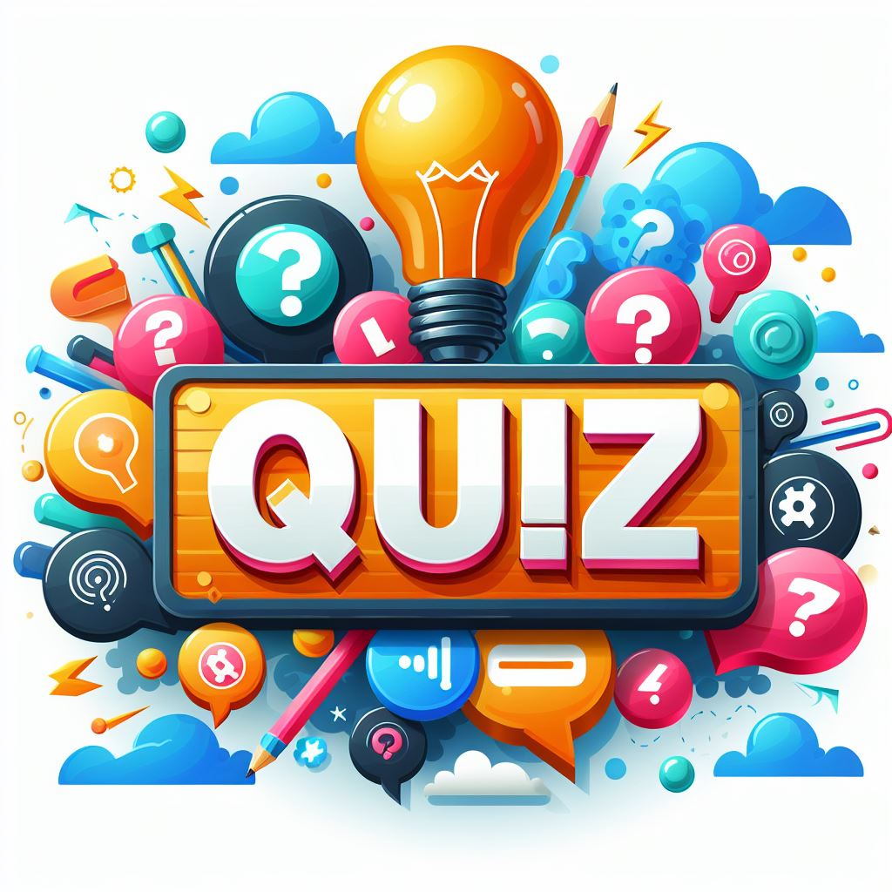
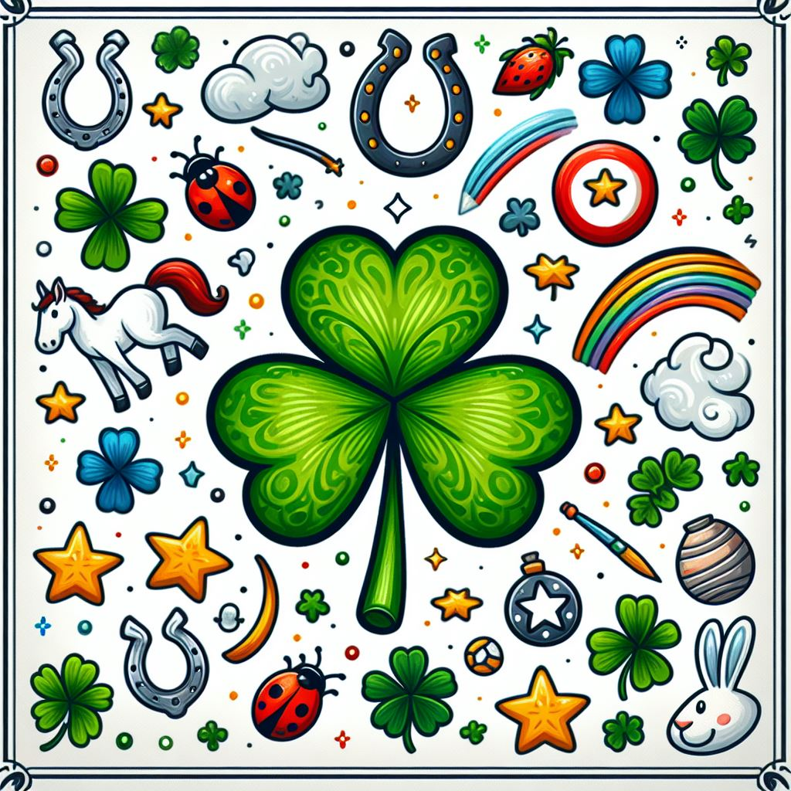

  

## Spielbeschreibung

Willkommen zu unserem spannenden Quiz-Spiel, das Ihre Kenntnisse in verschiedenen Bereichen wie Sport, Geschichte und Programmieren auf die Probe stellt. Dieses Spiel ist eine hervorragende Möglichkeit, Ihr Wissen zu testen und gleichzeitig Spaß zu haben. Es bietet eine Vielzahl von Fragen, die entweder mit mehreren Optionen oder mit wahr/falsch beantwortet werden können. Für jede richtige Antwort sammeln Sie 10 Punkte.

## Spielregeln

Das Spiel folgt einem Punktesystem, bei dem Sie Punkte für jede richtige Antwort sammeln. Allerdings verlieren Sie Punkte für jede falsche Antwort - 3 Punkte in der Kategorie Sport und bis zu 5 Punkte in den restlichen Kategorien.

Wenn Sie alle richtigen Antworten in einer Frage auswählen, erhalten Sie die volle Punktzahl. Wenn Sie jedoch nur eine von mehreren richtigen Antworten auswählen, erhalten Sie die Hälfte der Punkte. Wählen Sie eine falsche Antwort neben der richtigen Antwort, verlieren Sie alle Punkte für diese Frage.

Für geografische Fragen oder Fragen, die sich auf die Landkarte beziehen, gibt es eine Reaktionszeit von 25 Sekunden, da es nur eine richtige Antwort gibt. Wenn die Zeit überschritten wird, werden Sie sofort zur nächsten Frage weitergeleitet und verlieren dadurch die Punkte für die vorherige Frage.

Wir hoffen, dass Sie dieses Spiel genießen und dabei Ihr Wissen erweitern können. Viel Spaß beim Spielen und viel Erfolg beim Sammeln von Punkten! Mögen die besten Kenntnisse gewinnen!

## Viel Spaß!

  

